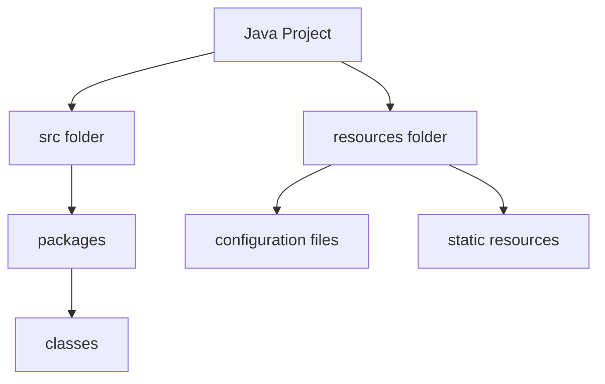
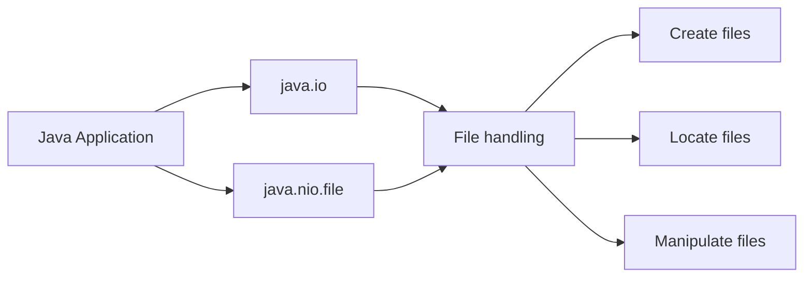
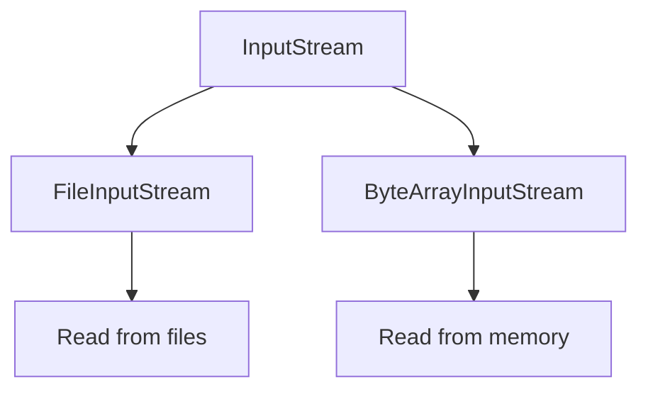
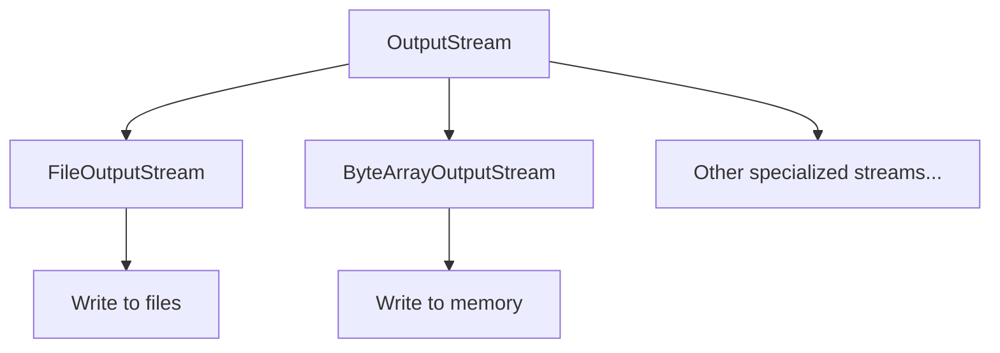
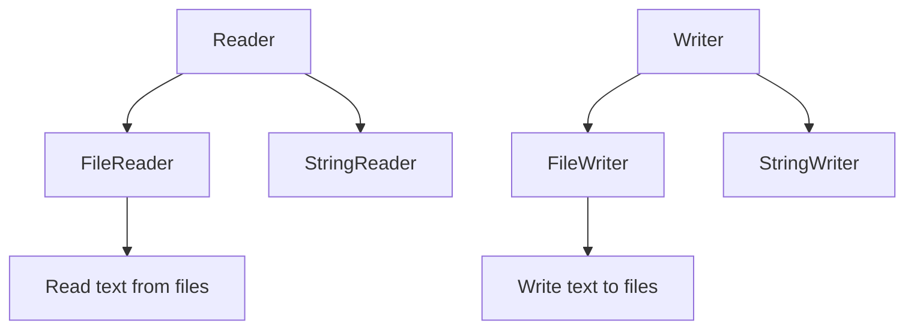
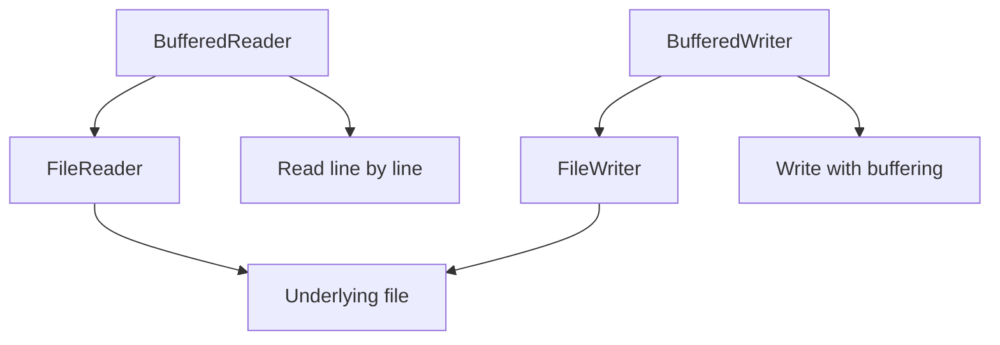

# Java I/O Lab

## Agenda

1. [Project Setup](#1-project-setup)
2. [Creating and Locating Files](#2-creating-and-locating-files)
3. [Reading with Input Streams](#3-reading-with-input-streams)
4. [Writing with Output Streams](#4-writing-with-output-streams)
5. [Character-based I/O with Readers and Writers](#5-character-based-io-with-readers-and-writers)
6. [Buffered I/O Operations](#6-buffered-io-operations)

## 1. Project Setup

### Concept Introduction: Java Project Structure

In Java development, organizing your code into projects and packages is crucial for maintainability and scalability. A typical Java project structure includes:

- **Project**: The top-level container for all your code and resources.
- **Packages**: Directories that group related classes.
- **Classes**: Individual Java files containing code.



### Explanation

Creating a well-structured project is the first step in Java development. It helps in organizing code, managing dependencies, and separating concerns. In this lab, we'll create a simple project structure.

### Code Example

```java
// File: src/com/example/iolab/Main.java
package com.example.iolab;

public class Main {
    public static void main(String[] args) {
        System.out.println("Hello, Java I/O!");
    }
}
```

### DIY Task

Create the project structure as follows:
1. Create a folder named `resources` in your project root (i.e., at the same level as the `src` folder (NOT inside the `src` folder))
2. Create a package named "com.example.iolab".
3. In this package, create a class named `Main`.
4. Add a `main` method to the `Main` class and print "Hello, Java I/O!" to the console.
5. Run the program to ensure it works correctly.

## 2. Creating and Locating Files

### Concept Introduction: File Handling in Java

Java provides robust file handling capabilities through the `java.io` and `java.nio.file` packages. Understanding how to create, locate, and manipulate files is fundamental to I/O operations.



### Explanation

In Java, you can create files programmatically or manually. The `Path` interface from `java.nio.file` is the modern way to represent file and directory pathnames. In this lab, we'll create a file manually and use Java to locate it.

### Code Example

```java
import java.nio.file.Path;
import java.nio.file.Paths;
import java.nio.file.Files;

public class Main {
    public static void main(String[] args) {
        // Get the project's root directory
        Path projectRoot = Paths.get(System.getProperty("user.dir"));
        
        // Construct the path to input.txt
        Path inputFilePath = projectRoot.resolve("resources").resolve("input.txt");
        
        // Check if the file exists
        if (Files.exists(inputFilePath)) {
            System.out.println("input.txt found at: " + inputFilePath.toAbsolutePath());
        } else {
            System.out.println("input.txt not found!");
        }
    }
}
```

### DIY Task

1. Create a new text file named "input.txt" and put it in the resources folder.
2. Open input.txt and type the following text: "Hello, Java I/O! This is a test file.", then save and close the file.
3. Modify your `main` method to print the absolute path of "input.txt" using the code example above.
4. Add error handling to your code to gracefully handle the case where the file doesn't exist.

## 3. Reading with Input Streams

### Concept Introduction: Input Streams

Input streams in Java are used to read data from a source, such as a file, network connection, or in-memory buffer. The base class for all input streams is `java.io.InputStream`.



### Explanation

`FileInputStream` is a concrete implementation of `InputStream` used specifically for reading bytes from files. It's useful for reading binary data or when you need low-level control over reading operations.

### Code Example (using try-catch-finally)

```java
import java.io.FileInputStream;
import java.io.IOException;

public class Main {
    public static void main(String[] args) {
        String filePath = "resources/input.txt";
        FileInputStream fis = null;
        
        try {
            fis = new FileInputStream(filePath);
            int data;
            while ((data = fis.read()) != -1) {
                System.out.print((char) data);
            }
        } catch (IOException e) {
            System.err.println("Error reading file: " + e.getMessage());
        } finally {
            try {
                if (fis != null) {
                    fis.close();
                }
            } catch (IOException e) {
                System.err.println("Error closing file: " + e.getMessage());
            }
        }
    }
}
```

### DIY Task

1. Implement the code to read from "input.txt" using `FileInputStream` with try-catch-finally.
2. Modify the code to count the number of characters in the file.
3. Add error handling for potential `FileNotFoundException` and `IOException`.
4. Print both the content of the file and the character count to the console.

## 4. Writing with Output Streams

### Concept Introduction: Output Streams

Output streams in Java are used to write data to a destination, such as a file, network connection, or in-memory buffer. The base class for all output streams is `java.io.OutputStream`.



### Explanation

`FileOutputStream` is a concrete implementation of `OutputStream` used for writing bytes to files. It can create a new file or append to an existing file, making it versatile for various writing operations.

### Code Example (introducing try-with-resources)

```java
import java.io.FileInputStream;
import java.io.FileOutputStream;
import java.io.IOException;

public class Main {
    public static void main(String[] args) {
        String inputPath = "resources/input.txt";
        String outputPath = "resources/output.txt";
        
        try (FileInputStream fis = new FileInputStream(inputPath);
             FileOutputStream fos = new FileOutputStream(outputPath)) {
            
            int data;
            while ((data = fis.read()) != -1) {
                fos.write(data);
            }
            System.out.println("File copied successfully.");
        } catch (IOException e) {
            System.err.println("Error copying file: " + e.getMessage());
        }
    }
}
```

### DIY Task

1. Implement the code to copy the content from "input.txt" to a new file "output.txt" using `FileInputStream` and `FileOutputStream` with try-with-resources.
2. Modify the code to append to "output.txt" instead of overwriting it.
3. Add a feature to convert all text to uppercase when writing to the output file.
4. Compare this implementation with the previous try-catch-finally approach and note the benefits of try-with-resources.

## 5. Character-based I/O with Readers and Writers

### Concept Introduction: Readers and Writers

While Input/Output streams deal with byte data, Readers and Writers are designed to work with character data, making them more suitable for text processing.



### Explanation

`FileReader` and `FileWriter` are character streams that are convenient for reading and writing text files. They internally handle the conversion between bytes and characters using the default character encoding.

### Code Example

```java
import java.io.FileReader;
import java.io.FileWriter;
import java.io.IOException;

public class Main {
    public static void main(String[] args) {
        String inputPath = "resources/input.txt";
        String outputPath = "resources/output.txt";
        
        try (FileReader reader = new FileReader(inputPath);
             FileWriter writer = new FileWriter(outputPath)) {
            
            int character;
            while ((character = reader.read()) != -1) {
                writer.write(Character.toUpperCase((char) character));
            }
            System.out.println("File copied and converted to uppercase.");
        } catch (IOException e) {
            System.err.println("Error processing file: " + e.getMessage());
        }
    }
}
```

### DIY Task

1. Modify your previous code to use `FileReader` and `FileWriter` instead of `FileInputStream` and `FileOutputStream`.
2. Implement a feature to count the number of vowels in the input file.
3. Write a summary at the end of the output file that includes the total character count and vowel count.
4. Add proper exception handling and resource management using try-with-resources.

## 6. Buffered I/O Operations

### Concept Introduction: Buffered I/O

Buffered I/O operations improve performance by reducing the number of direct reads and writes to the underlying stream. They work by reading or writing chunks of data at a time, storing them in a buffer.



### Explanation

`BufferedReader` and `BufferedWriter` wrap around existing Readers and Writers, adding buffering capabilities. This can significantly improve performance, especially when reading or writing large amounts of data.

### Code Example

```java
import java.io.BufferedReader;
import java.io.BufferedWriter;
import java.io.FileReader;
import java.io.FileWriter;
import java.io.IOException;

public class Main {
    public static void main(String[] args) {
        String inputPath = "resources/input.txt";
        String outputPath = "resources/output.txt";
        
        try (BufferedReader reader = new BufferedReader(new FileReader(inputPath));
             BufferedWriter writer = new BufferedWriter(new FileWriter(outputPath))) {
            
            String line;
            while ((line = reader.readLine()) != null) {
                writer.write(line.toUpperCase());
                writer.newLine();
            }
            System.out.println("File processed with buffered I/O.");
        } catch (IOException e) {
            System.err.println("Error processing file: " + e.getMessage());
        }
    }
}
```

### DIY Task

1. Update your code to use `BufferedReader` and `BufferedWriter`.
2. Implement a word count feature that counts the number of words in the input file.
3. Modify the program to write every other word in uppercase to the output file.
4. Add a progress indicator that prints a dot to the console for every 100 words processed.

---
End of Lab
